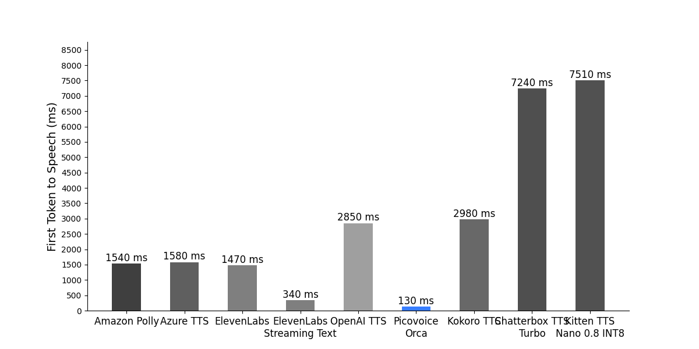
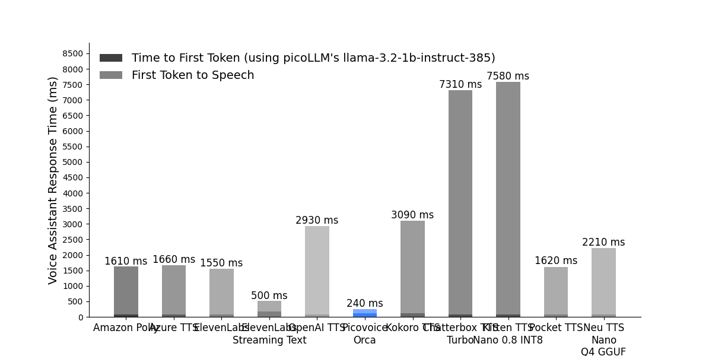
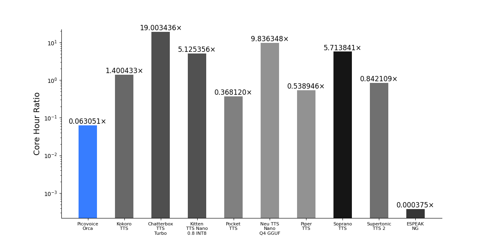
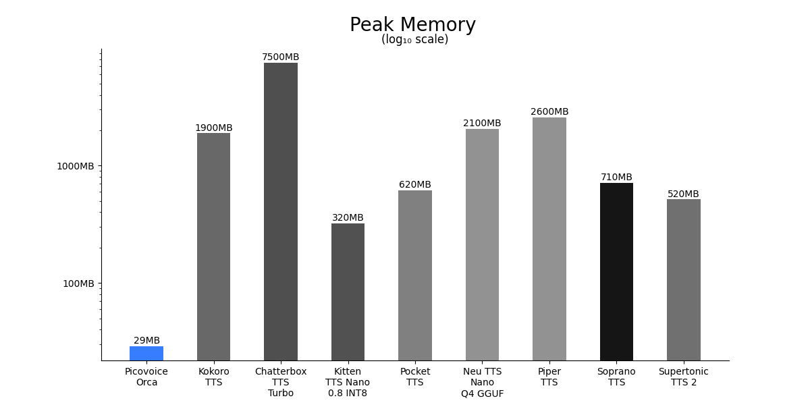

# Text-to-Speech Benchmark

Made in Vancouver, Canada by [Picovoice](https://picovoice.ai)

This repo is a minimalist and extensible framework for benchmarking various aspects of different text-to-speech (TTS) engines.

## Table of Contents

- [Overview](#overview)
- [Data](#data)
- [Engines](#engines)
- [Metrics](#metrics)
- [Usage](#usage)
- [Results](#results)

## Overview

This benchmark simulates user - voice-assistant interactions, by generating LLM responses to user questions
and synthesizing the response to speech as soon as possible.
We sample user queries from a public dataset and feed them to [picoLLM](https://picovoice.ai/picollm/) (`llama-3.2-1b-instruct-385`).
picoLLM generates responses token-by-token, which are passed to different text-to-speech (TTS) engines
to compare e.g. their response times.

## Data

The public [taskmaster2](https://github.com/google-research-datasets/Taskmaster/tree/master/TM-2-2020) dataset contains text data of goal oriented
conversations between a user and an assistant.
We randomly select user questions from these example conversations and use them as input to the LLM.
The topics of the user queries are diverse and include flight booking, food ordering, hotel booking, movies and music
recommendations, restaurant search, and sports.
The LLM is prompted to answer the questions like a helpful voice assistant to simulate a real-world user - AI
agent interactions. The responses of the LLM have various lengths, from a few words to a few sentences, to cover a wide
range of realistic responses.

## Engines

The TTS engines include the following:
- Cloud APIs:
	- [Amazon Polly](https://aws.amazon.com/polly/).
	- [Azure Text-to-Speech](https://azure.microsoft.com/en-us/services/cognitive-services/text-to-speech/).
	- [ElevenLabs](https://elevenlabs.io/).
	    - With streaming audio output only.
	    - With streaming input using [WebSocket API](https://elevenlabs.io/docs/api-reference/websockets).
	- [OpenAI TTS](https://platform.openai.com/docs/guides/text-to-speech).
- On-device TTS running on CPU:
	- [Picovoice Orca Streaming Text-to-Speech](https://picovoice.ai/platform/orca/).
	- [Kokoro-TTS](https://github.com/hexgrad/kokoro).
	- [Chatterbox-TTS-Turbo](https://github.com/resemble-ai/chatterbox).
	- [Kitten-TTS-Nano-0.8-INT8](https://github.com/KittenML/KittenTTS).
	- [Pocket-TTS](https://github.com/kyutai-labs/pocket-tts).
	- [Neu-TTS-Nano-Q4-GGUF](https://github.com/neuphonic/neutts).
	- [Piper-TTS](https://github.com/OHF-Voice/piper1-gpl).
	- [Soprano-TTS](https://github.com/ekwek1/soprano).
	- [Supertonic-TTS-2](https://github.com/supertone-inc/supertonic).
	- [Espeak-NG](https://github.com/espeak-ng/espeak-ng).

Most of the above engines support streaming audio output, except for Chatterbox-TTS-Turbo and Kitten-TTS-Nano.
Elevenlabs also supports streaming input using a WebSocket API.
This is done by chunking the text at punctuation marks and sending pre-analyzed text chunks to the engine.
Orca Streaming TTS supports input text streaming without relying on special language markers.
Orca can handle the raw LLM tokens as soon as they are produced.

## Metrics

Our metrics include the following:
1. [First Token To Speech Latency](#first-token-to-speech--voice-assistant-response-time)
2. [Voice Assistant Response Time](#first-token-to-speech--voice-assistant-response-time)
3. [CPU Core Hour Ratio](#cpu-core-hour-ratio)
4. [Peak Memory (RAM) Usage](#peak-memory-ram-usage)
5. [Model Size](#model-size)
6. Platform Support
7. Language Support
8. Audio Sample Quality

For 1~3 above, we use a large language model (LLM) running locally on CPU to simulate the real-world scenario of having LLM + TTS as a voice assistant. Note that for a complete voice assistant application we also need to consider the time it takes for the Speech-to-Text system to send the request. Since we can use real-time Speech-to-Text engines like Picovoice's [Cheetah Streaming Speech-to-Text](https://picovoice.ai/platform/cheetah/), we can assume that the latency introduced by the Speech-to-Text is small compared to the total response time. Head over to our GitHub demo at [LLM Voice Assistant](https://github.com/Picovoice/orca/tree/main/demo/llm_voice_assistant), showcasing a real voice-to-voice conversation with [picoLLM](https://picovoice.ai/picollm/), using different TTS systems.

### First Token To Speech & Voice Assistant Response Time:

Response times are typically measured with the `time-to-first-byte` metric, which is the time taken from the moment a
request was sent until the first byte is received.
In the context of assistants we care about the time it takes for the assistant to respond to the user.
For LLM-based voice assistants we define:

- **Voice Assistant Response Time (VART)**: Time taken from the moment the user's request is sent to the LLM, until the
  TTS engine produces the first byte of speech.

The `VART` metric is the sum of the following components:

- **Time to First Token (TTFT)**: Time taken from the moment the user's request is sent to the LLM, until the LLM
  produces the first byte of text.
- **First Token to Speech (FTTS)**: Time taken from the moment the LLM produces the first text token,
  until the TTS engine produces the first byte of speech.

The `TTFT` metric depends on the LLM and network latency in the case of LLM APIs.

The `FTTS` metric depends on the capabilities of the TTS engine, and whether it can handle streaming input text,
as well as the generation speed of the LLM.
In order to measure the `FTTS` metric, it is important to keep the LLM behavior constant across all experiments.

We believe the `FTTS` metric is the most appropriate way to measure the response time of a TTS engine in the context of
voice assistants. This is because it gets closest to the behavior of humans, who can start reading a response as
soon as the first token appears.

### CPU Core Hour Ratio:

We define **CPU Core Hour Ratio** as the amount of CPU Core Hour it takes to generate an hour of speech. This is to ensure a fair comparison between TTS models that use a large number of CPU cores and those that only use 1 or 2 CPU cores. We define "CPU Core Hour" by summing over the number of hours that each CPU core takes to generate the speech.

### Peak Memory (RAM) Usage:

We define **Peak Memory (RAM) Usage** as the peak RAM usage of TTS when generating speech, excluding that of LLM inference and initial Python set-up.

### Model Size:

We define **Model Size** as the file size of the binary files needed to run TTS, excluding common Python packages like PyTorch. For example, if a model is to be downloaded from Hugging Face, then we only count the binary files there, which can be `.safetensors`, `.bin`, `.gguf`, `.pt`, `.pth`, `.onnx`, ... If a TTS model requires a G2P such as `misaki` or `espeak-ng`, we additionally count the size of that as well.

## Usage

In order to closely reproduce our numbers, you'll need a machine with the following specifications:
- `Ubuntu 22.04`
- `Python 3.10`
- a consumer-grade AMD CPU (`AMD Ryzen 7 5700X (16) @ 4.6GHz`)
- 64 GB of RAM (`DDR4 @ 3600MT/s`)
- 2 consumer grade GPUs for running the LLM (`GeForce RTX 3060 12GB (12GB)`)
- Ensure your system's CPU and GPU load is low for accurate results

- Install the requirements:
	```console
	pip3 install -r requirements.txt
	```
	- Note: For Orca and Cloud APIs, above requirements suffice. However, for other on-device models, since the package requirements conflict with each other, so we provide the exact package versions via `pip freeze` that we use to run those models. they are listed under the `requirements/` directory. You will need different virtual environments to run different on-device models.

- Download the picoLLM model

For each benchmark a picoLLM model is required to generate responses from the LLM. Replace `${PICOLLM_MODEL_PATH}` with
the path to it in the following instructions. The picoLLM model used in the benchmark is `llama-3.2-1b-instruct-385` and can be
downloaded from [Picovoice Console](https://console.picovoice.ai/picollm).

- Get an AccessKey

For each benchmark a Picovoice AccessKey is required to generate responses from the LLM. Replace `${PV_ACCESS_KEY}` with
it in the following instructions. Everyone who signs up for
[Picovoice Console](https://console.picovoice.ai/) receives a unique AccessKey.

In the following, we provide instructions for running the benchmark for each engine.

### Amazon Polly Instructions

For metric 1 & 2.

Replace `${AWS_PROFILE}` with the name of the AWS profile you wish to use.

```console
python3 benchmark.py \
--picovoice-access-key ${PV_ACCESS_KEY} \
--picollm-model-path ${PICOLLM_MODEL_PATH} \
--engine amazon_polly \
--aws-profile-name ${AWS_PROFILE}
```

### Azure Text-to-Speech Instructions

For metric 1 & 2.

Replace `${AZURE_SPEECH_KEY}` and `${AZURE_SPEECH_LOCATION}` with the information from your Azure account.

```console
python3 benchmark.py \
--picovoice-access-key ${PV_ACCESS_KEY} \
--picollm-model-path ${PICOLLM_MODEL_PATH} \
--engine azure_tts \
--azure-speech-key ${AZURE_SPEECH_KEY} \
--azure-speech-region ${AZURE_SPEECH_LOCATION}
```

### ElevenLabs Instructions

For metric 1 & 2.

Replace `${ELEVENLABS_API_KEY}` with your ElevenLabs API key.

Without input streaming:

```console
python3 benchmark.py \
--picovoice-access-key ${PV_ACCESS_KEY} \
--picollm-model-path ${PICOLLM_MODEL_PATH} \
--engine elevenlabs \
--elevenlabs-api-key ${ELEVENLABS_API_KEY}
```

With input streaming:

```console
python3 benchmark.py \
--picovoice-access-key ${PV_ACCESS_KEY} \
--picollm-model-path ${PICOLLM_MODEL_PATH} \
--engine elevenlabs_websocket \
--elevenlabs-api-key ${ELEVENLABS_API_KEY}
```

### OpenAI TTS Instructions

For metric 1 & 2.

Replace `${OPENAI_API_KEY}` with your OpenAI API key.

```console
python3 benchmark.py \
--picovoice-access-key ${PV_ACCESS_KEY} \
--picollm-model-path ${PICOLLM_MODEL_PATH} \
--openai-api-key ${OPENAI_API_KEY} \
--engine openai_tts
```

### Picovoice Orca Instructions

For metric 1 & 2 & 3.

Replace `${PV_ACCESS_KEY}` with your Picovoice AccessKey.

```console
python3 benchmark.py \
--picovoice-access-key ${PV_ACCESS_KEY} \
--picollm-model-path ${PICOLLM_MODEL_PATH} \
--engine picovoice_orca \
```

For metric 4.

```console
for i in 1 2 3 4 5 6 7 8 9 10 20 40 80; do
	python3 benchmark.py \
	--picovoice-access-key ${PV_ACCESS_KEY} \
	--picollm-model-path ${PICOLLM_MODEL_PATH} \
	--engine picovoice_orca \
	--test-memory-size-multiple $i \
done
```

### Kokoro-TTS Instructions

Hugging face model download commit hash:
- Repo: `hexgrad/Kokoro-82M`.
- Commit hash: `f3ff3571791e39611d31c381e3a41a3af07b4987`.

For metric 1 & 2 & 3.

Replace `${PV_ACCESS_KEY}` with your Picovoice AccessKey.

```console
python3 benchmark.py \
--picovoice-access-key ${PV_ACCESS_KEY} \
--picollm-model-path ${PICOLLM_MODEL_PATH} \
--engine kokoro_tts \
```

For metric 4.

```console
for i in 1 2 3 4 5 6 7 8 9 10 20 40 80; do
	python3 benchmark.py \
	--picovoice-access-key ${PV_ACCESS_KEY} \
	--picollm-model-path ${PICOLLM_MODEL_PATH} \
	--engine kokoro_tts \
	--test-memory-size-multiple $i \
done
```

### Chatterbox-TTS-Turbo Instructions

Hugging face model download commit hash:
- Repo: `ResembleAI/chatterbox-turbo`.
- Commit hash: `749d1c1a46eb10492095d68fbcf55691ccf137cd`.

For metric 1 & 2 & 3.

Replace `${PV_ACCESS_KEY}` with your Picovoice AccessKey.

```console
python3 benchmark.py \
--picovoice-access-key ${PV_ACCESS_KEY} \
--picollm-model-path ${PICOLLM_MODEL_PATH} \
--engine chatterbox_tts_turbo \
```

For metric 4.

```console
for i in 1 2 3 4 5 6 7 8 9 10 20 40 80; do
	python3 benchmark.py \
	--picovoice-access-key ${PV_ACCESS_KEY} \
	--picollm-model-path ${PICOLLM_MODEL_PATH} \
	--engine chatterbox_tts_turbo \
	--test-memory-size-multiple $i \
done
```

### Kitten-TTS-Nano-0.8-INT8 Instructions

Hugging face model download commit hash:
- Repo: `KittenML/kitten-tts-nano-0.8-int8`.
- Commit hash: `84781d74e29ee25217551556398b42f80593a813`.

For metric 1 & 2 & 3.

Replace `${PV_ACCESS_KEY}` with your Picovoice AccessKey.

```console
python3 benchmark.py \
--picovoice-access-key ${PV_ACCESS_KEY} \
--picollm-model-path ${PICOLLM_MODEL_PATH} \
--engine kitten_tts \
```

For metric 4.

```console
for i in 1 2 3 4 5 6 7 8 9 10 20 40 80; do
	python3 benchmark.py \
	--picovoice-access-key ${PV_ACCESS_KEY} \
	--picollm-model-path ${PICOLLM_MODEL_PATH} \
	--engine kitten_tts \
	--test-memory-size-multiple $i \
done
```

### Pocket-TTS Instructions

Hugging face model download commit hash: 
- Repo: `kyutai/pocket-tts`:
	- Commit hash: `427e3d61b276ed69fdd03de0d185fa8a8d97fc5b`.
- Repo: `kyutai/pocket-tts-without-voice-cloning`:
	- Commit hash:
		- `embeddings_v2`: `2578fed2380333b621689eaed6fe144cf69dfeb3`.
		- `tokenizer.model`: `d4fdd22ae8c8e1cb3634e150ebeff1dab2d16df3`.

For metric 1 & 2 & 3.

Replace `${PV_ACCESS_KEY}` with your Picovoice AccessKey.

```console
python3 benchmark.py \
--picovoice-access-key ${PV_ACCESS_KEY} \
--picollm-model-path ${PICOLLM_MODEL_PATH} \
--engine pocket_tts \
```

For metric 4.

```console
for i in 1 2 3 4 5 6 7 8 9 10 20 40 80; do
	python3 benchmark.py \
	--picovoice-access-key ${PV_ACCESS_KEY} \
	--picollm-model-path ${PICOLLM_MODEL_PATH} \
	--engine pocket_tts \
	--test-memory-size-multiple $i \
done
```

### Neu-TTS-Nano-Q4-GGUF Instructions

Hugging face model download commit hash:
- Repo: `neuphonic/neutts-nano-q4-gguf`.
	- Commit hash: `8ae1694877fdf9d7c4a7bee2cc9775ba7eab3923`.
- Repo: `neuphonic/neucodec-onnx-decoder`.
	- Commit hash: `55b95ccfb0b0a63bd033f0f78e6366607a616a33`.

For metric 1 & 2 & 3.

Replace `${PV_ACCESS_KEY}` with your Picovoice AccessKey.
Replace `${REF_TEXT_PATH}` with the path to the reference text for voice cloning. E.g. `--neutts-ref-text-path ~/neutts/samples/jo.txt`.
Replace `${REF_CODES_PATH}` with the path to the reference codes for voice cloning. E.g. `--neutts-ref-codes-path ~/neutts/samples/jo.pt`.

```console
python3 benchmark.py \
--picovoice-access-key ${PV_ACCESS_KEY} \
--picollm-model-path ${PICOLLM_MODEL_PATH} \
--engine neu_tts_nano_q4_gguf \
--neutts-ref-text-path ${REF_TEXT_PATH} \
--neutts-ref-codes-path ${REF_CODES_PATH} \
```

For metric 4.

```console
for i in 1 2 3 4 5 6 7 8 9 10 20 40 80; do
	python3 benchmark.py \
	--picovoice-access-key ${PV_ACCESS_KEY} \
	--picollm-model-path ${PICOLLM_MODEL_PATH} \
	--engine neu_tts_nano_q4_gguf \
	--neutts-ref-text-path ${REF_TEXT_PATH} \
	--neutts-ref-codes-path ${REF_CODES_PATH} \
	--test-memory-size-multiple $i \
done
```

### Piper-TTS Instructions

Hugging face model download commit hash:
- Repo: `rhasspy/piper-voices`.
- Commit hash:
	- `en_US-lessac-low.onnx`: `217ddc79818708b078d0d14a8fae9608b9d77141`.

For metric 1 & 2 & 3.

Replace `${PV_ACCESS_KEY}` with your Picovoice AccessKey.
Replace  `PIPER_MODEL_PATH` with the path to Piper-TTS model. E.g. `--pipertts-model-path ~/piper1-gpl/en_US-lessac-low.onnx`.

```console
python3 benchmark.py \
--picovoice-access-key ${PV_ACCESS_KEY} \
--picollm-model-path ${PICOLLM_MODEL_PATH} \
--engine piper_tts \
--pipertts-model-path ${PIPER_MODEL_PATH} \
```

For metric 4.

```console
for i in 1 2 3 4 5 6 7 8 9 10 20 40 80; do
	python3 benchmark.py \
	--picovoice-access-key ${PV_ACCESS_KEY} \
	--picollm-model-path ${PICOLLM_MODEL_PATH} \
	--engine piper_tts \
	--pipertts-model-path ${PIPER_MODEL_PATH} \
	--test-memory-size-multiple $i \
done
```

### Soprano-TTS Instructions

Hugging face model download commit hash:
- Repo: `ekwek/Soprano-1.1-80M`.
- Commit hash: `27b5a5f5f541a1db3a51d6fd1b0fc7147b92cd01`.

For metric 1 & 2 & 3.

Replace `${PV_ACCESS_KEY}` with your Picovoice AccessKey.

```console
python3 benchmark.py \
--picovoice-access-key ${PV_ACCESS_KEY} \
--picollm-model-path ${PICOLLM_MODEL_PATH} \
--engine soprano_tts \
```

For metric 4.

```console
for i in 1 2 3 4 5 6 7 8 9 10 20 40 80; do
	python3 benchmark.py \
	--picovoice-access-key ${PV_ACCESS_KEY} \
	--picollm-model-path ${PICOLLM_MODEL_PATH} \
	--engine soprano_tts \
	--test-memory-size-multiple $i \
done
```

### Supertonic-TTS-2 Instructions

Cloned GitHub repo.
- GitHub:
	- Repo: `supertone-inc/supertonic`.
	- Commit hash: `6fc89ea89eb29defb0ff2230b77c5a519acfe2a9`.
- Hugging face model download commit hash:
	- Repo: `Supertone/supertonic-2`.
	- Commit hash: `75e6727618a02f323c720cba9478152d4bc16ca4`.

For metric 1 & 2 & 3.

Replace `${PV_ACCESS_KEY}` with your Picovoice AccessKey.
Replace `${SUPERTONIC_REPO_DIR}` with the path to Supertonic-TTS-2's repo. E.g. `--supertonictts-repo-dir ~/supertonic/`.
Replace `${SUPERTONIC_ONNX_DIR}` with the path to Supertonic-TTS-2's repo. E.g. `--supertonictts-onnx-dir ~/supertonic/py/assets/onnx/`.
Replace `${SUPERTONIC_VOICE_STYLE_PATH}` with the path to Supertonic-TTS-2's repo. E.g. `--voice-style-path ~/supertonic/py/assets/voice_styles/M1.json`.

```console
python3 benchmark.py \
--picovoice-access-key ${PV_ACCESS_KEY} \
--picollm-model-path ${PICOLLM_MODEL_PATH} \
--engine supertonic_tts_2 \
--supertonictts-repo-dir ${SUPERTONIC_REPO_DIR} \
--supertonictts-onnx-dir ${SUPERTONIC_ONNX_DIR} \
--supertonictts-voice-style-path ${SUPERTONIC_VOICE_STYLE_PATH} \
```

For metric 4.

```console
for i in 1 2 3 4 5 6 7 8 9 10 20 40 80; do
	python3 benchmark.py \
	--picovoice-access-key ${PV_ACCESS_KEY} \
	--picollm-model-path ${PICOLLM_MODEL_PATH} \
	--engine supertonic_tts_2 \
	--supertonictts-repo-dir ${SUPERTONIC_REPO_DIR} \
	--supertonictts-onnx-dir ${SUPERTONIC_ONNX_DIR} \
	--supertonictts-voice-style-path ${SUPERTONIC_VOICE_STYLE_PATH} \
	--test-memory-size-multiple $i \
done
```

### Espeak-NG Instructions

```console
sudo apt install espeak-ng
```
Version: 1.50.

For metric 1 & 2 & 3.

Replace `${PV_ACCESS_KEY}` with your Picovoice AccessKey.

```console
python3 benchmark.py \
--picovoice-access-key ${PV_ACCESS_KEY} \
--picollm-model-path ${PICOLLM_MODEL_PATH} \
--engine espeak_ng \
```

For metric 4.

```console
for i in 1 2 3 4 5 6 7 8 9 10 20 40 80; do
	python3 benchmark.py \
	--picovoice-access-key ${PV_ACCESS_KEY} \
	--picollm-model-path ${PICOLLM_MODEL_PATH} \
	--engine espeak_ng \
	--test-memory-size-multiple $i \
done
```

## Results:
### First Token to Speech:


### Voice Assistant Response Time:


### Core Hour Ratio:


### Peak Memory:

### **Model Size & Language Support:**

|          Engine          | Model size | Language Support                                                                                                                                                                                                                                                                                                                                                                                                                                                                                                                                                                                                                                                                                                                                                                                                                                                                                                                                                                                                                                                                        |
| :----------------------: | :--------: | --------------------------------------------------------------------------------------------------------------------------------------------------------------------------------------------------------------------------------------------------------------------------------------------------------------------------------------------------------------------------------------------------------------------------------------------------------------------------------------------------------------------------------------------------------------------------------------------------------------------------------------------------------------------------------------------------------------------------------------------------------------------------------------------------------------------------------------------------------------------------------------------------------------------------------------------------------------------------------------------------------------------------------------------------------------------------------------- |
|      Picovoice Orca      |    7MB     | English, German, French, Spanish, Italian, Portuguese, Japanese, Korean.                                                                                                                                                                                                                                                                                                                                                                                                                                                                                                                                                                                                                                                                                                                                                                                                                                                                                                                                                                                                                |
|        Kokoro-TTS        |   341MB    | English, Spanish, French, Hindi, Italian, Japanese, Brazilian Portuguese, Mandarin Chinese.                                                                                                                                                                                                                                                                                                                                                                                                                                                                                                                                                                                                                                                                                                                                                                                                                                                                                                                                                                                             |
|   Chatterbox-TTS-Turbo   |   2.98GB   | Arabic, Danish, German, Greek, English, Spanish, Finnish, French, Hebrew, Hindi, Italian, Japanese, Korean, Malay, Dutch, Norwegian, Polish, Portuguese, Russian, Swedish, Swahili, Turkish, Chinese.                                                                                                                                                                                                                                                                                                                                                                                                                                                                                                                                                                                                                                                                                                                                                                                                                                                                                   |
| Kitten-TTS-Nano-0.8-INT8 |    42MB    | English.                                                                                                                                                                                                                                                                                                                                                                                                                                                                                                                                                                                                                                                                                                                                                                                                                                                                                                                                                                                                                                                                                |
|        Pocket-TTS        |   242MB    | English.                                                                                                                                                                                                                                                                                                                                                                                                                                                                                                                                                                                                                                                                                                                                                                                                                                                                                                                                                                                                                                                                                |
|   Neu-TTS-Nano-Q4-GGUF   |   507MB    | English, German, Spanish, French.                                                                                                                                                                                                                                                                                                                                                                                                                                                                                                                                                                                                                                                                                                                                                                                                                                                                                                                                                                                                                                                       |
|        Piper-TTS         |    61MB    | Arabic, Bulgarian, Catalan, Czech, Welsh, Danish, German, Greek, English, Spanish, Farsi, Finnish, French, Hindi, Hungarian, Indonesian, Icelandic, Italian, Georgian, Kazakh, Luxembourgish, Latvian, Malayalam, Nepali, Dutch, Norwegian, Polish, Portuguese, Romanian, Russian, Slovak, Slovenian, Serbian, Swedish, Swahili, Telugu, Turkish, Ukrainian, Vietnamese, Chinese.                                                                                                                                                                                                                                                                                                                                                                                                                                                                                                                                                                                                                                                                                                       |
|       Soprano-TTS        |   280MB    | English.                                                                                                                                                                                                                                                                                                                                                                                                                                                                                                                                                                                                                                                                                                                                                                                                                                                                                                                                                                                                                                                                                |
|     Supertonic-TTS-2     |   262MB    | English, Spanish, Portuguese, French, Korean.                                                                                                                                                                                                                                                                                                                                                                                                                                                                                                                                                                                                                                                                                                                                                                                                                                                                                                                                                                                                                                           |
|        ESpeak-NG         |    1MB     | Afrikaans, Albanian, Amharic, Arabic, Aragonese, Armenian, Assamese, Azerbaijani, Bashkir, Chuvash, Basque, Belarusian, Bengali, Bishnupriya Manipuri, Bosnian, Bulgarian, Burmese, Catalan, Cherokee, Chinese, Hawaiian, Croatian, Czech, Danish, Dutch, English, Esperanto, Estonian, Persian, Finnish, French, Gaelic, Georgian, German, Greek, Greenlandic, Guarani, Gujarati, Haitian Creole, Hebrew, Hindi, Hungarian, Icelandic, Indonesian, Interlingua, Ido, Italian, Japanese, Kannada, Konkani, Korean, Kurdish, Kazakh, Kyrgyz, Latin, Luxembourgish, Latgalian, Latvian, Lingua Franca Nova, Lithuanian, Lojban, Māori, Macedonian, Malay, Malayalam, Maltese, Marathi, Nahuatl, Nepali, Norwegian Bokmål, Nogai, Oriya, Oromo, Papiamento, Pyash, Polish, Lang Belta, Quechua, K'iche', Quenya, Portuguese, Punjabi, Klingon, Romanian, Russian, Ukrainian, Sindarin, Serbian, Setswana, Sindhi, Shan (Tai Yai), Sinhala, Slovak, Slovenian, Lule Saami, Spanish, Swahili, Swedish, Tamil, Thai, Turkmen, Tatar, Telugu, Turkish, Uyghur, Urdu, Uzbek, Vietnamese, Welsh. |

### Platform Support:


|          Engine          | Linux<br>(x86_64)                                                                                           | macOS<br>(x86_64)                                                                                           | maxOS<br>(arm64)                                                                                            | Windows<br>(x86_64)                                                                                         | Windows<br>(arm64)                                                                                              | Android                                                                                                     | iOS                                                                                                         | Raspberry<br>Pi 3                                                                                           | Raspberry<br>Pi 4                                                                                           | Raspberry<br>Pi 5                                                                                           | Chrome                                                                                                      | Safari                                                                                                      | Firefox                                                                                                     | Edge                                                                                                        |
| :----------------------: | ----------------------------------------------------------------------------------------------------------- | ----------------------------------------------------------------------------------------------------------- | ----------------------------------------------------------------------------------------------------------- | ----------------------------------------------------------------------------------------------------------- | --------------------------------------------------------------------------------------------------------------- | ----------------------------------------------------------------------------------------------------------- | ----------------------------------------------------------------------------------------------------------- | ----------------------------------------------------------------------------------------------------------- | ----------------------------------------------------------------------------------------------------------- | ----------------------------------------------------------------------------------------------------------- | ----------------------------------------------------------------------------------------------------------- | ----------------------------------------------------------------------------------------------------------- | ----------------------------------------------------------------------------------------------------------- | ----------------------------------------------------------------------------------------------------------- |
|      Picovoice Orca      |  |  |  |  |      |  |  |  |  |  |  |  |  |  |
|        Kokoro-TTS        |  |  |  |  |                     |                 |                 |                 |                 |                 |  |  |  |  |
|   Chatterbox-TTS-Turbo   |  |  |  |  |  |                 |                 |                 |                 |                 |                 |                 |                 |                 |
| Kitten-TTS-Nano-0.8-INT8 |  |  |  |  |      |  |  |  |  |  |  |  |  |  |
|        Pocket-TTS        |  |  |  |  |                     |                 |                 |                 |                 |                 |                 |                 |                 |                 |
|   Neu-TTS-Nano-Q4-GGUF   |  |  |  |  |      |  |  |                 |                 |                 |                 |                 |                 |                 |
|        Piper-TTS         |  |  |  |  |                     |                 |                 |                 |                 |                 |                 |                 |                 |                 |
|       Soprano-TTS        |  |  |  |  |                     |                 |                 |                 |                 |                 |                 |                 |                 |                 |
|     Supertonic-TTS-2     |  |  |  |  |      |  |  |  |  |  |  |  |  |  |
|        ESpeak-NG         |  |  |  |  |                     |  |                 |                 |                 |                 |                 |                 |                 |                 |

### Audio Sample:

<table>
<tr>
<td align="center">
    
**Picovoice Orca**
</td>
<td align="center">
    
**Kokoro-TTS**
</td>
</tr>

<tr>
<td align="center">

[Picovoice Orca](https://github.com/user-attachments/assets/d7c70439-44ef-4eae-86ca-4014c40d7039)

</td>
<td align="center">
    
[Kokoro-TTS](https://github.com/user-attachments/assets/8d7770b7-3d6c-4222-8158-8080a1dea055)

</td>
</tr>
</table>

---

<table>

<tr>
<td align="center">
    
**Chatterbox-TTS-Turbo**
</td>
<td align="center">
    
**Kitten-TTS-Nano**
</td>
</tr>

<tr>
<td align="center">
    
[Chatterbox-TTS-Turbo](https://github.com/user-attachments/assets/c8644127-ae96-4743-9f24-c89fdeeeccd4)
</td>
<td align="center">
    
[Kitten-TTS-Nano](https://github.com/user-attachments/assets/bf76987f-f996-4bf2-ac12-38a7459775c2)
</td>
</tr>
</table>

---


<table>
<tr>
<td align="center">
    
**Pocket-TTS**
</td>
<td align="center">
    
**Neu-TTS-Nano**
</td>
</tr>

<tr>
<td align="center">

[Pocket-TTS](https://github.com/user-attachments/assets/4a43a49e-2769-4129-b81d-1250cdbc4b85)

</td>
<td align="center">
    
[Neu-TTS-Nano](https://github.com/user-attachments/assets/fcbd976d-65b5-43d1-a7b0-c379d4ee01fe)

</td>
</tr>
</table>

---


<table>
<tr>
<td align="center">
    
**Piper-TTS**
</td>
<td align="center">

**Soprano-TTS**
</td>
</tr>

<tr>
<td align="center">

[Piper-TTS](https://github.com/user-attachments/assets/fc19b68c-cfdd-4030-94ac-4b2dfc3212e3)

</td>
<td align="center">
    
[Soprano-TTS](https://github.com/user-attachments/assets/389950e9-f5ba-45db-b2e2-76a331037b55)

</td>
</tr>
</table>


---

<table>
<tr>
<td align="center">
    
**Supertonic-TTS-2**
</td>
<td align="center">
    
**Espeak-NG**
</td>
</tr>

<tr>
<td align="center">

[Supertonic-TTS-2](https://github.com/user-attachments/assets/11bc0488-103c-4d75-bfc5-9347ea2e0624)
</td>
<td align="center">

[Espeak-NG](https://github.com/user-attachments/assets/9285f63b-1b5f-400f-b438-ab0da1833584)

</td>
</tr>
</table>
